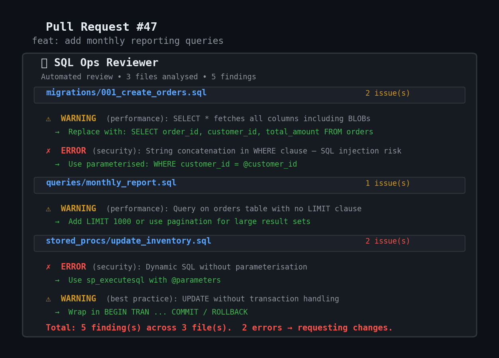

<div align="center">

# SQL Ops Reviewer

**AI-powered SQL review for pull requests — no API keys, no cloud**

[](https://github.com/marketplace/actions/sql-ops-reviewer)
[-000000?style=flat-square)](https://ollama.com)
[]()

</div>

---

SQL in PRs gets merged without review. This fixes that. One YAML file, zero API keys.

---

## See it run

<!-- DROP YOUR SCREENSHOT HERE — capture an actual PR review comment -->
<div align="center">

</div>

```
Developer opens PR with 3 changed .sql files
         │
         ▼
┌───────────────────────────────────────────────────────────┐
│  GitHub Actions runner (ubuntu-latest)                     │
│                                                           │
│  $ curl -fsSL https://ollama.com/install.sh | sh          │
│  $ ollama pull phi3:mini                                   │
│  → Model cached (2.5 GB, skipped on subsequent runs)      │
│                                                           │
│  Parsing PR diff...                                        │
│    migrations/001_create_orders.sql    → 42 lines changed │
│    queries/monthly_report.sql          → 18 lines changed │
│    stored_procs/update_inventory.sql   → 67 lines changed │
│                                                           │
│  Analysing with Ollama (phi3:mini)...                     │
│                                                           │
│  migrations/001_create_orders.sql:                        │
│    ⚠ WARNING (performance): SELECT * fetches all columns  │
│      → Replace with: SELECT order_id, customer_id, total  │
│    ✗ ERROR (security): String concatenation in WHERE      │
│      → Use parameterised: WHERE customer_id = @customer_id│
│                                                           │
│  queries/monthly_report.sql:                              │
│    ⚠ WARNING (performance): Missing LIMIT on large table  │
│      → Add LIMIT or TOP to prevent full table scan        │
│                                                           │
│  stored_procs/update_inventory.sql:                       │
│    ✗ ERROR (security): Dynamic SQL without parameterisation│
│      → Use sp_executesql with parameters                  │
│    ⚠ WARNING (best practice): Missing transaction handling│
│      → Wrap UPDATE in BEGIN TRAN / COMMIT                 │
│                                                           │
│  Posting review comment on PR...                          │
│  → 5 findings across 3 files                              │
│  → 2 errors detected → requesting changes                 │
└───────────────────────────────────────────────────────────┘
```

---

## Setup — one file

```yaml
# .github/workflows/sql-review.yml
name: SQL Review
on:
  pull_request:
    paths:
      - '**/*.sql'

permissions:
  contents: read
  pull-requests: write

jobs:
  review:
    runs-on: ubuntu-latest
    steps:
      - uses: actions/checkout@v4
      - uses: Pawansingh3889/sql-ops-reviewer@v1
        with:
          github-token: ${{ secrets.GITHUB_TOKEN }}
```

That's it. Every PR that touches `.sql` gets reviewed automatically.

---

## What it catches — 10 analysis categories

```
PERFORMANCE
  ✗ SELECT * in production queries
  ✗ Missing WHERE on large tables
  ✗ Subqueries that should be JOINs
  ✗ Functions on indexed columns (kills index usage)
  ✗ Missing LIMIT/TOP on unbounded queries

SECURITY
  ✗ SQL injection via string concatenation
  ✗ Hardcoded credentials in queries
  ✗ Dynamic SQL without parameterisation
  ✗ GRANT/REVOKE without justification

BEST PRACTICES
  ✗ Missing table aliases
  ✗ Inconsistent naming conventions
  ✗ No transaction handling on writes
  ✗ Deprecated syntax (e.g., *= for outer join)
```

---

## How it works — inside the runner

```
PR opened with .sql changes
         │
         ▼
┌──────────────────────┐
│ 1. Install Ollama    │ ← curl | sh (one-time)
│ 2. Pull model        │ ← phi3:mini (cached after first run)
│ 3. Parse PR diff     │ ← diff_parser.py extracts changed SQL
│ 4. Analyse SQL       │ ← sql_analyzer.py sends to Ollama with rules prompt
│ 5. Post PR comment   │ ← github_client.py posts structured review
└──────────────────────┘
         │
         ▼
Review comment on PR with:
  - File-by-file findings
  - Severity level (info/warning/error)
  - Fix suggestions with code
  - Request changes if errors found
```

**Everything runs inside the GitHub Actions runner.** Ollama installed at runtime. Model cached. SQL analysed locally. Zero external API calls. Nothing leaves the CI machine.

---

## The review output

When the action runs, it posts this on your PR:

```
## SQL Ops Reviewer

### migrations/001_create_orders.sql
Found 2 issue(s).

⚠ WARNING (performance): Query uses SELECT * which fetches all columns including BLOBs
  → Replace with specific columns:
    SELECT order_id, customer_id, total_amount FROM orders

✗ ERROR (security): String concatenation in WHERE clause creates SQL injection risk
  → Use parameterized queries:
    WHERE customer_id = @customer_id

### queries/monthly_report.sql
Found 1 issue(s).

⚠ WARNING (performance): Query on orders table with no LIMIT
  → Add LIMIT 1000 or use pagination for large result sets

Total: 3 finding(s) across 2 file(s).
```

If any **error**-level findings → the action requests changes on the PR.

---

## Configuration

| Input | Default | What it does |
|---|---|---|
| `github-token` | `${{ github.token }}` | Token for posting PR reviews |
| `model` | `phi3:mini` | Ollama model (swap for more accuracy) |
| `severity` | `warning` | Minimum severity to report |
| `file-pattern` | `**/*.sql` | Glob pattern for SQL files |

### Stricter reviews with a bigger model

```yaml
- uses: Pawansingh3889/sql-ops-reviewer@v1
  with:
    github-token: ${{ secrets.GITHUB_TOKEN }}
    model: 'llama3.1:8b'
    severity: 'error'
```

---

## Performance

```
Model            RAM      Review time (per file)   Quality
─────────────    ─────    ─────────────────────    ──────────────────────
phi3:mini        ~4 GB    10-20 seconds            Good for common patterns
llama3.1:8b      ~6 GB    20-40 seconds            Better for complex queries
```

First run: downloads model (~2.5 GB). Subsequent runs: cached.

Requirements: GitHub Actions runner with 7GB+ RAM (standard `ubuntu-latest` works).

---

## Why local AI?

Same design philosophy as [OpsMind](https://github.com/Pawansingh3889/OpsMind). Factory compliance databases hold sensitive schema. Sending SQL to cloud APIs is a compliance risk. Ollama runs on the CI runner. The SQL never leaves the machine.

---

One YAML file. Zero API keys. Every PR with SQL changes gets caught.

**[Code](https://github.com/Pawansingh3889/sql-ops-reviewer)** &#183; **[Report Bug](https://github.com/Pawansingh3889/sql-ops-reviewer/issues)**
